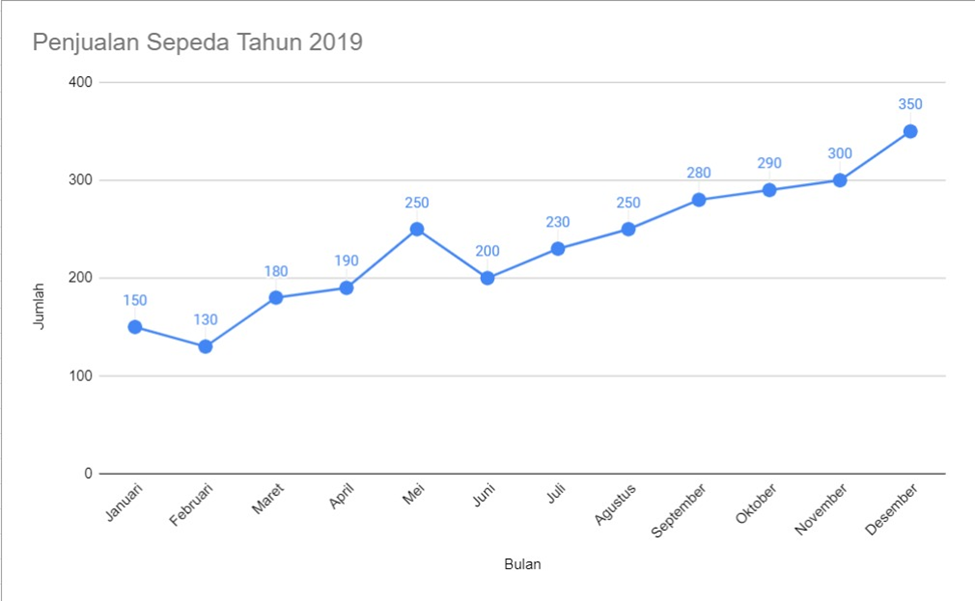

## Media Visualisasi Data
Visualisasi data adalah bentuk presentasi grafis yang dibuat untuk menyampaikan informasi dari data yang dimiliki. Beberapa jenis visualisasi data yang populer digunakan adalah dalam bentuk diagram lingkaran, diagram garis, maupun diagram batang.

### 1. Tabel
#### Pengertian Tabel
Menurut Wikipedia, tabel merupakan susunan data yang disajikan dalam baris dan kolom, atau mungkin dalam struktur yang lebih kompleks. Biasanya tabel ini digunakan dalam berkomunikasi, melakukan atau menyajikan data penelitian, hingga melakukan analisis data. Sehingga Anda biasanya akan menemui tabel di media cetak, tulisan, perangkat lunak komputer, dan lain sebagainya.

Tentu saja tabel tersebut akan menggambarkan isi dan terminologi yang bergantung pada konteks data yang disajikan sehingga secara lebih lanjut, secara signifikan tabel dapat memuat berbagai informasi yang berbeda dalam jenis, struktur, fleksibilitas, notasi, representasi, dan juga penggunaannya.
#### Fungsi tabel
* **Memberi Informasi yang Ringkas dan Padat** 
 Fungsi tabel yang pertama adalah tabel digunakan untuk menjelaskan suatu fakta atau informasi secara singkat dan lebih menarik daripada dengan menggunakan kata-kata. Selain itu, tabel juga memiliki fungsi yaitu untuk mendukung para penulis menyampaikan berbagai ide atau gagasan, sehingga dapat memengaruhi dan juga meyakinkan para pembaca.

* **Memudahkan Pembaca** 
    Fungsi tabel yang selanjutnya adalah tabel dapat memberikan kemudahan bagi para pembacanya, karena data yang disajikan di dalam tabel tersebut telah disusun secara sistematis, sehingga lebih mudah untuk dapat dimengerti. Selain itu, tabel juga dapat memberikan informasi secara mendetail mengenai adanya perubahan 
    Pasti terdapat perubahan yang terjadi pada suatu data, entah itu merupakan kenaikan atau penurunan data, sehingga harus disampaikan pada pembaca melalui informasi yang tercantum di dalam tabel. Tabel juga memiliki fungsi untuk memberikan ikhtisar kepada para pembaca yang disajikan dalam bentuk angka-angka yang tersusun secara rapi.

* **Menggeneralisasikan Komunikasi** 
    sebagai alat komunikasi yang mana tabel tersebut akan memungkinkan suatu bentuk generalisasi informasi dari berbagai jenis konteks sosial atau ilmiah yang tidak terbatas. Hal ini akhirnya membuat tabel menyediakan cara yang lebih akrab untuk dapat menyampaikan informasi yang mungkin tidak jelas, agar pembaca lebih dapat memahami informasi di dalam tabel dengan mudah.
* **Menjelaskan Fakta** 
    Terakhir, tabel memiliki fungsi untuk menjelaskan fakta. Di dalam tabel biasanya tercantum data dalam bentuk informasi yang didapatkan dari penelitian, dari sumber, dan lain sebagainya yang tentu saja data dan informasi di dalam tabel tersebut mampu dipertanggungjawabkan.

#### Contoh 

### 2. Diagram
Diagram adalah suatu gambaran untuk memperlihatkan atau menerangkan suatu data yang akan disajikan. Atau definisi diagram yang lainnya adalah lambang-lambang tertentu yang dapat dipakai untuk menjelaskan sarana, prosedur serta kegiatan-kegiatan yang sudah biasa dilaksanakan dalam suatu sistem.
> Sering kali kita mendengar kata Diagram. Sebenarnya apa itu diagram? Diagram merupakan sebuah representasi data yang digambarkan dalam bentuk grafik. Jika Anda memiliki sebuah data yang ingin diproyeksikan dalam bentuk diagram, berikut beberapa tipe diagram yang bisa digunakan.

#### Fungsi diagram
Diagram memengaruhi pikiran sehingga orang yang melihat memahaminya, tetapi tidak dengan cara seseorang memahami kata-kata. Diagram dapat digunakan untuk alasan yang berbeda, seperti untuk menunjukkan bagian dari keseluruhan, langkah-langkah dari suatu proses, dan hubungan.

Sebuah bantuan grafis akan menampilkan informasi secara visual sehingga pembaca dapat lebih memahami dan mengingat ide-ide. Macam-macam diagram memberi pembaca gambaran tentang bagaimana suatu proses atau hubungan bekerja. Beberapa diagram menggambarkan informasi dalam teks. Lainnya menambahkan informasi baru yang penting.
### 3. Diagram Batang
Pada umumnya digunakan untuk menggambarkan perkembangan nilai-nilai suatu objek penelitian dalam kurun waktu tertentu. Diagram batang menunjukkan berbagai keterangan dengan batang-batang tegak ataupun mendatar dan sama lebar dengan batang-batang terpisah. 
 
### 4. Diagram Garis
Penyajian data statistik dengan memakai diagram berbentuk garis lurus disebut dengan diagram garis lurus ataupun diagram garis. Diagram garis biasanya dipakai untuk menyajikan data statistik yang didapat berdasarkan pengamatan dari waktu ke waktu secara berurutan.

Sumbu X menunjukkan waktu pengamatan, Sedangkan sumbu Y menunjukkan nilai-nilai data pengamatan untuk suatu waktu tertentu. Kumpulan waktu dan juga pengamatan membentuk titik-titik pada bidang XY, Lalu selanjutnya kolom dari tiap dua titik yang berdekatan tadi dihubungkan dengan garis lurus sehingga akan didapat diagram garis atau sering disebut juga grafik garis. 
 
### 5. Diagram Lingkaran
Diagram lingkaran (atau bagan pai) adalah sebuah diagram berbentuk lingkaran yang dibagi menjadi irisan-irisan untuk menggambarkan proporsi numerik. Dalam sebuah diagram lingkaran, panjang busur setiap irisan (dan alhasil, sudut pusat dan luasnya), proporsional dengan kuantitas yang diwakilinya. Meskipun diagram ini diberi nama karena kemiripannya dengan pai yang telah diiris, terdapat variasi-variasi dalam cara menyajikannya. Diagram lingkaran terawal yang diketahui umumnya dipercayai terdapat pada Statistical Breviary karya William Playfair tahun 1801.

Diagram lingkaran sangat banyak digunakan di dunia bisnis dan media massa. Namun, diagram ini telah dikritik, dan banyak ahli menyarankan untuk menghindarinya,dengan memperhatikan bahwa penelitian telah menunjukkan sulit untuk membandingkan bagian-bagian yang berbeda dari diagram lingkaran tertentu, atau untuk membandingkan data di berbagai diagram lingkaran yang berbeda. Diagram lingkaran bisa diganti dalam banyak hal dengan skema lain seperti diagram batang, diagram kotak garis, skema titik, dll. 

###### Refensi
* [Tabel](https://penerbitdeepublish.com/pengertian-tabel/)
* [Diagram Linkaran](https://id.wikipedia.org/wiki/Diagram_lingkaran#/media/Berkas:Distribution_of_Wealth_in_Indonesia.svg)
* [Belajar Visual Data](https://www.dicoding.com/academies/177)