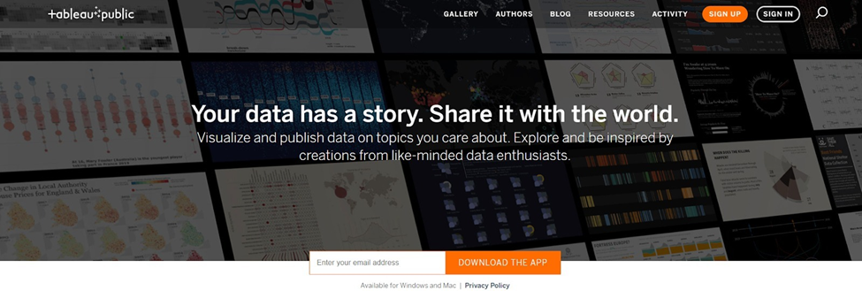
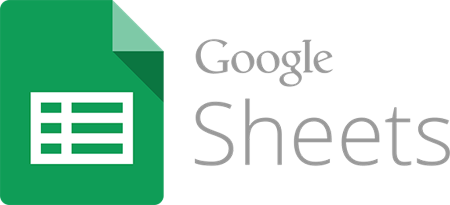
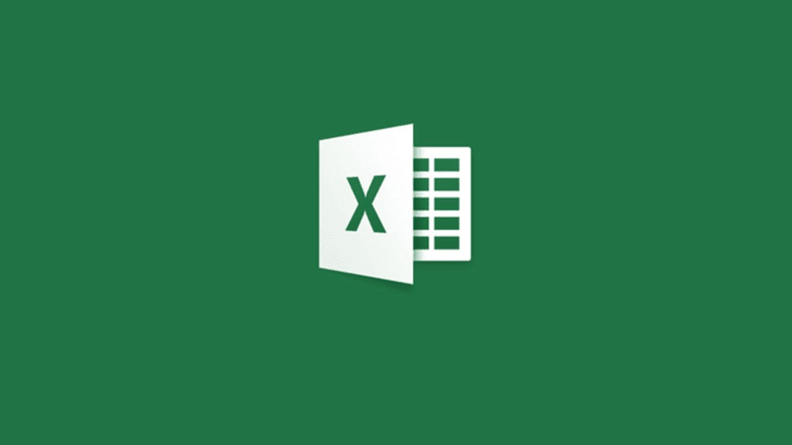

# Tools dalam Visualisasi Data
## 1. [Tableau Public](https://public.tableau.com/app/discover)
 
Tableau adalah aplikasi populer yang bisa diandalkan untuk membuat visualisasi data menjadi lebih sederhana. Jika dibandingkan Power BI vs Tableau atau Google Data Studio vs Tableau , maka Tableau memang memiliki lebih banyak kelebihan, jadi wajar saja jika aplikasi ini memiliki jumlah pengguna yang sangat banyak.

### Fungsi Tableu
* Menerjemahkan Data Menjadi Bentuk Visualisasi
* Mengimpor Berbagai Ukuran dan Range Data
* Membuat Visualisasi Data Tanpa Coding

## 2. [Google Sheets](https://docs.google.com/spreadsheets)
 
Google Sheets adalah progam lembatang sebar yang disertakan sebagai bagian dari rangkaian Google Docs Editor berbasis web bebas yang ditawarkan oleh Google. Layanan ini juga mencakup Google Docs, Google Slides, Google Gambar, Google Formulir, Google Sites, dan Google Keep. Google Sheets tersedia sebagai aplikasi web, aplikasi seluler untuk Android, iOS, Windows, BlackBerry, dan sebagai aplikasi desktop di Google Chrome OS . Aplikasi ini kompatibel dengan format file Microsoft Excel.[2] Aplikasi ini memungkinkan pengguna untuk membuat dan mengedit file secara daring sambil berkolaborasi dengan pengguna lain secara real-time. Hasil edit dilacak oleh pengguna dengan riwayat revisi yang menyajikan perubahan. Posisi editor disorot dengan kursor dan warna khusus editor dan sistem perizinan mengatur apa yang dapat dilakukan pengguna. Pembaruan telah memperkenalkan fitur yang menggunakan pemelajaran mesin, termasuk "Jelajahi", yang menawarkan jawaban berdasarkan pertanyaan bahasa alami di spreadsheet.

### Fungsi Sheet
* Membuat Tabel
* Membuat Grafik

## 3. [Ms. Excel](https://www.microsoft.com/id-id/microsoft-365/excel)
 
Microsoft Excel atau Microsoft Office Excel adalah sebuah program aplikasi lembar kerja yang dibuat dan didistribusikan oleh Microsoft Corporation yang dapat dijalankan pada Microsoft Windows dan Mac OS. Aplikasi ini merupakan bagian dari Microsoft Office. Aplikasi ini memiliki fitur kalkulasi dan pembuatan grafik dengan menggunakan strategi marketing Microsoft yang agresif, menjadikan Microsoft Excel sebagai salah satu program komputer yang populer digunakan di dalam komputer mikro hingga saat ini. Bahkan, saat ini program ini merupakan program spreadsheet paling banyak digunakan oleh banyak pihak, baik di platform PC berbasis Windows maupun platform Macintosh berbasis Mac OS, semenjak versi 5.0 diterbitkan pada tahun 1993.

### Fungsi Ms.Excel
* Membuat Tabel
* Membuat Grafik
#### Refensi :
* [Tableu](https://glints.com/id/lowongan/tableau-adalah/)
* [Sheets](https://glints.com/id/lowongan/google-sheet-adalah/)
* [Pengertian Google sheet](https://id.wikipedia.org/wiki/Google_Sheets)
* [Pengertian Ms Excel](https://id.wikipedia.org/wiki/Microsoft_Excel)
* [Belajar Visual Dasar](https://www.dicoding.com/academies/177)